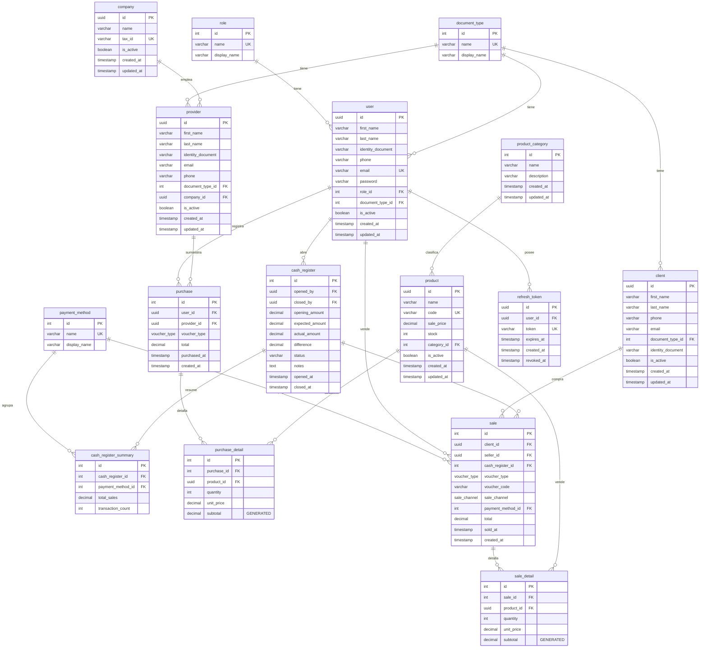

# Sistema de Ventas Valhalla

Sistema completo de punto de venta (POS) con gestión de inventario, compras, ventas, caja registradora y analytics. Backend REST API desacoplado + Frontend web.

## Stack tecnológico

| Capa | Tecnología |
|------|------------|
| **Backend** | Node.js 20+ · Express 5 · TypeScript · Sequelize |
| **Base de datos** | PostgreSQL 16 (Supabase en producción, Docker en desarrollo) |
| **Frontend** | Next.js (por implementar) |
| **Auth** | JWT (access token + refresh token en httpOnly cookie) |
| **Documentación** | Swagger / OpenAPI 3.0 |
| **Deployment** | Docker · Docker Compose |

## Estructura del monorepo

```
SistemaWebVentasValhalla/
├── api/                 → Backend (Express + TypeScript)
├── web/                 → Frontend (Next.js — por implementar)
├── docker-compose.yml   → Orquestación de servicios (por implementar)
└── README.md            → Este archivo
```

---

## Backend (api/)

### Requisitos previos

- Node.js 18+
- pnpm 10+
- PostgreSQL 16+ (local via Docker o Supabase)

### Instalación

```bash
cd api
pnpm install
```

### Configuración de variables de entorno

```bash
cp .env.example .env
```

Edita `.env` con los datos de tu base de datos (ver sección de migración más abajo).

### Scripts disponibles

| Comando | Descripción |
|---------|-------------|
| `pnpm run dev` | Servidor en modo desarrollo (hot-reload) |
| `pnpm run build` | Compilar TypeScript para producción |
| `pnpm run start` | Ejecutar build de producción |
| `pnpm run typecheck` | Verificar tipos sin compilar |
| `pnpm run migrate` | Ejecutar migraciones pendientes |
| `pnpm run seed` | Insertar datos iniciales |
| `pnpm run lint` | Ejecutar ESLint |

### Estructura del backend

```
api/src/
├── config/              → Configuración (BD, Swagger, env vars)
├── common/
│   ├── errors/          → Clases de error (AppError, NotFound, etc.)
│   ├── middlewares/     → Auth, validación, error handler, rate limit
│   ├── helpers/         → Response wrapper, paginación
│   └── logger.ts       → Pino logger
├── database/
│   ├── migrations/      → Archivos de migración (umzug)
│   └── seeders/         → Datos iniciales
├── modules/             → Módulos por dominio (auth, user, product, etc.)
├── app.ts               → Configuración Express
├── routes.ts            → Registro de rutas
└── index.ts             → Entry point
```

---

## Ejecutar migración de base de datos en PostgreSQL

El proyecto usa **umzug** para manejar migraciones en TypeScript. Las migraciones crean todas las tablas, ENUMs, índices, constraints y triggers necesarios.

### Opción A: Base de datos en Supabase (remoto)

#### 1. Crear proyecto en Supabase

1. Ir a [supabase.com](https://supabase.com) → **New Project**
2. Configurar nombre, contraseña de BD y región
3. Esperar ~2 minutos a que se cree

#### 2. Obtener credenciales

Ir a **Project Settings → Database → Connection parameters**:

| Variable | Dónde encontrarla |
|----------|-------------------|
| `DB_HOST` | Campo "Host" (ej: `db.abcdefgh.supabase.co`) |
| `DB_PORT` | `5432` (conexión directa) o `6543` (pooler) |
| `DB_NAME` | `postgres` (siempre es este) |
| `DB_USER` | `postgres` (directa) o `postgres.tu-ref` (pooler) |
| `DB_PASS` | La contraseña que definiste al crear el proyecto |

**¿Cuál puerto usar?**
- `5432` (directa): Para desarrollo, migraciones y scripts. Máx ~15 conexiones en free tier.
- `6543` (pooler): Para producción con muchos usuarios. Reutiliza conexiones.

#### 3. Configurar `.env`

```env
DB_HOST=db.abcdefgh.supabase.co
DB_PORT=5432
DB_NAME=postgres
DB_USER=postgres
DB_PASS=tu-contraseña-segura
```

---

### Opción B: Base de datos local con Docker

#### 1. Levantar PostgreSQL con Docker

```bash
docker run -d \
  --name valhalla-postgres \
  -e POSTGRES_DB=valhalla_sales \
  -e POSTGRES_USER=postgres \
  -e POSTGRES_PASSWORD=localdev123 \
  -p 5432:5432 \
  postgres:16-alpine
```

#### 2. Configurar `.env`

```env
DB_HOST=localhost
DB_PORT=5432
DB_NAME=valhalla_sales
DB_USER=postgres
DB_PASS=localdev123
```

---

### Ejecutar migraciones

Una vez configurado el `.env` con cualquiera de las dos opciones:

```bash
cd api

# Crear todas las tablas
pnpm run migrate

# Insertar datos iniciales (roles, tipos de documento, categorías, admin)
pnpm run seed
```

Salida esperada:

```
[INFO] ⬆️  Running pending migrations...
[INFO] (2025.08.07T01-create-enums.ts): migrated
[INFO] (2025.08.07T02-create-reference-tables.ts): migrated
[INFO] (2025.08.07T03-create-company.ts): migrated
[INFO] (2025.08.07T04-create-user.ts): migrated
[INFO] (2025.08.07T05-create-provider.ts): migrated
[INFO] (2025.08.07T06-create-client.ts): migrated
[INFO] (2025.08.07T07-create-product.ts): migrated
[INFO] (2025.08.07T08-create-cash-register.ts): migrated
[INFO] (2025.08.07T09-create-purchase.ts): migrated
[INFO] (2025.08.07T10-create-sale.ts): migrated
[INFO] (2025.08.07T11-create-refresh-token.ts): migrated
[INFO] (2025.08.07T12-create-updated-at-trigger.ts): migrated
[INFO] ✅ All migrations applied
```

### Otros comandos de migración

```bash
# Ver migraciones pendientes
pnpm run migrate pending

# Revertir la última migración
pnpm run migrate down
```

### Datos iniciales (seeders)

El seeder crea:

| Tabla | Datos |
|-------|-------|
| `role` | admin, seller |
| `document_type` | DNI, Pasaporte, Carnet de Extranjería, Otro |
| `payment_method` | Efectivo, Yape, Plin, Tarjeta débito, Tarjeta de crédito |
| `product_category` | Gaseosas, Licores, Piqueos, Golosinas, Bebidas no alcohólicas |
| `user` | Admin por defecto (email: `admin@valhalla.com`, password: `Admin123!`) |

> ⚠️ Cambia la contraseña del admin en producción.

### Resetear la base de datos (desarrollo)

Si necesitas empezar de cero:

**En Supabase:** Ir a SQL Editor y ejecutar:
```sql
DROP SCHEMA public CASCADE;
CREATE SCHEMA public;
GRANT ALL ON SCHEMA public TO postgres;
GRANT ALL ON SCHEMA public TO public;
```

Luego volver a correr `pnpm run migrate` y `pnpm run seed`.

**En Docker local:**
```bash
docker stop valhalla-postgres
docker rm valhalla-postgres
# Volver a crear el container y correr migraciones
```

---

## Modelado de datos

### Diagrama Entidad-Relación



### Explicación de las relaciones

#### Tablas de referencia (catálogos)

Estas tablas almacenan datos que rara vez cambian y son compartidos por toda la aplicación:

| Tabla | Propósito | Patrón |
|-------|-----------|--------|
| `role` | Define los roles del sistema (admin, seller) | Cada `user` tiene exactamente un rol |
| `document_type` | Tipos de documento de identidad (DNI, Pasaporte, etc.) | Usado por `user`, `provider` y `client` |
| `payment_method` | Formas de pago aceptadas | Cada `sale` tiene un método de pago |
| `product_category` | Clasificación de productos | Cada `product` pertenece a una categoría |

Todas tienen `name` (identificador interno en inglés) y `display_name` (etiqueta en español para la UI).

#### Entidades principales

| Tabla | Descripción | Relaciones clave |
|-------|-------------|------------------|
| `company` | Empresas proveedoras (identificadas por RUC) | Tiene muchos `provider` |
| `user` | Operadores del sistema (admins y vendedores) | Registra compras, realiza ventas, abre cajas |
| `provider` | Personas de contacto en empresas proveedoras | Pertenece a una `company`, suministra `purchase` |
| `client` | Clientes que compran productos | Opcional en ventas (ventas anónimas permitidas) |
| `product` | Artículos en inventario | Tiene código único (QR/barcode), stock controlado |

#### Módulo de caja (`cash_register`)

- `cash_register`: Representa una sesión de trabajo (apertura → ventas → cierre)
- `cash_register_summary`: Al cerrar, se genera un desglose de totales por método de pago
- Toda `sale` está vinculada a la caja abierta al momento de crearla
- Solo puede existir UNA caja con status `OPEN` a la vez

#### Transacciones: Compras

- `purchase`: Registro de una compra a proveedor (ingreso de stock)
- `purchase_detail`: Líneas de la compra (producto, cantidad, precio unitario)
- `subtotal` es una **columna generada** (`quantity * unit_price`) — PostgreSQL la calcula automáticamente
- Al crear una compra, el stock del producto **aumenta**

#### Transacciones: Ventas

- `sale`: Registro de una venta a cliente (salida de stock)
- `sale_detail`: Líneas de la venta (producto, cantidad, precio al momento)
- `subtotal` también es generada automáticamente
- Al crear una venta, el stock del producto **disminuye**
- `client_id` es nullable → permite ventas sin cliente registrado (walk-in)

#### Auth (`refresh_token`)

- Almacena refresh tokens para el flujo JWT
- Un usuario puede tener múltiples tokens activos (multi-dispositivo)
- `revoked_at` marca un token como invalidado (logout)
- `expires_at` controla la caducidad
- `ON DELETE CASCADE`: si se elimina un usuario, sus tokens se eliminan automáticamente

### Reglas de integridad

| Regla | Implementación |
|-------|----------------|
| No borrar productos con ventas | `ON DELETE RESTRICT` en FK de `sale_detail` |
| No borrar proveedores con compras | `ON DELETE RESTRICT` en FK de `purchase` |
| Precio siempre positivo | `CHECK (sale_price > 0)` en `product` |
| Stock nunca negativo | `CHECK (stock >= 0)` en `product` |
| Cantidad siempre positiva | `CHECK (quantity > 0)` en detalles |
| Subtotal calculado automático | `GENERATED ALWAYS AS (quantity * unit_price) STORED` |
| `updated_at` automático | Trigger PostgreSQL en todas las tablas con timestamps |
| Email único por usuario | `UNIQUE` constraint en `user.email` |
| RUC único por empresa | `UNIQUE` constraint en `company.tax_id` |
| Código único por producto | `UNIQUE` constraint en `product.code` |

---

## Modelos Sequelize-TypeScript

### ¿Cómo se definen los modelos?

El proyecto usa `sequelize-typescript` que permite definir modelos con **decoradores** (anotaciones sobre clases y propiedades). Cada modelo es una clase TypeScript que extiende `Model` y representa una tabla de la base de datos.

### Ejemplo de modelo

```typescript
@Table({ tableName: 'product', timestamps: true, createdAt: 'created_at', updatedAt: 'updated_at' })
export class Product extends Model {
  @Column({ type: DataType.UUID, primaryKey: true, defaultValue: DataType.UUIDV4 })
  declare id: string;

  @Column({ type: DataType.STRING(100), allowNull: false })
  declare name: string;

  @ForeignKey(() => ProductCategory)
  @Column({ type: DataType.INTEGER, allowNull: false, field: 'category_id' })
  declare categoryId: number;

  @BelongsTo(() => ProductCategory)
  declare category: ProductCategory;
}
```

### Decoradores utilizados

| Decorador | Propósito |
|-----------|-----------|
| `@Table` | Registra la clase como un modelo Sequelize y configura nombre de tabla y timestamps |
| `@Column` | Define una columna con su tipo, restricciones y mapeo a snake_case |
| `@ForeignKey(() => Model)` | Marca una columna como clave foránea hacia otro modelo |
| `@BelongsTo(() => Model)` | Relación muchos-a-uno (este modelo pertenece a otro) |
| `@HasMany(() => Model)` | Relación uno-a-muchos (este modelo tiene muchos hijos) |

### Convenciones

| Aspecto | Convención |
|---------|-----------|
| Propiedades en TypeScript | camelCase (`firstName`, `salePrice`) |
| Columnas en PostgreSQL | snake_case (`first_name`, `sale_price`) |
| Mapeo automático | `field: 'sale_price'` en `@Column` o `underscored: true` global |
| Tipos nullable | `declare phone: string \| null` |
| Columnas generadas (BD) | Se declaran como `readonly` sin setter |
| `declare` vs `=` | Siempre `declare` (Sequelize maneja la inicialización internamente) |

### Registro de modelos

Todos los modelos se registran en `src/config/database.ts` dentro del array `models`:

```typescript
export const sequelize = new Sequelize({
  // ...config
  models: [Role, DocumentType, PaymentMethod, ProductCategory, Company,
           User, Provider, Client, Product, Purchase, PurchaseDetail,
           Sale, SaleDetail, RefreshToken],
});
```

Esto activa las relaciones declaradas con decoradores y permite que Sequelize resuelva includes/joins automáticamente.

### Listado de modelos

| Módulo | Modelo | Tabla | Relaciones |
|--------|--------|-------|------------|
| catalog | `Role` | role | HasMany → User |
| catalog | `DocumentType` | document_type | — |
| catalog | `PaymentMethod` | payment_method | — |
| catalog | `ProductCategory` | product_category | HasMany → Product |
| company | `Company` | company | HasMany → Provider |
| user | `User` | user | BelongsTo → Role, DocumentType |
| provider | `Provider` | provider | BelongsTo → DocumentType, Company |
| client | `Client` | client | BelongsTo → DocumentType |
| product | `Product` | product | BelongsTo → ProductCategory |
| purchase | `Purchase` | purchase | BelongsTo → User, Provider · HasMany → PurchaseDetail |
| purchase | `PurchaseDetail` | purchase_detail | BelongsTo → Purchase, Product |
| sale | `Sale` | sale | BelongsTo → Client, User, PaymentMethod · HasMany → SaleDetail |
| sale | `SaleDetail` | sale_detail | BelongsTo → Sale, Product |
| auth | `RefreshToken` | refresh_token | BelongsTo → User |
