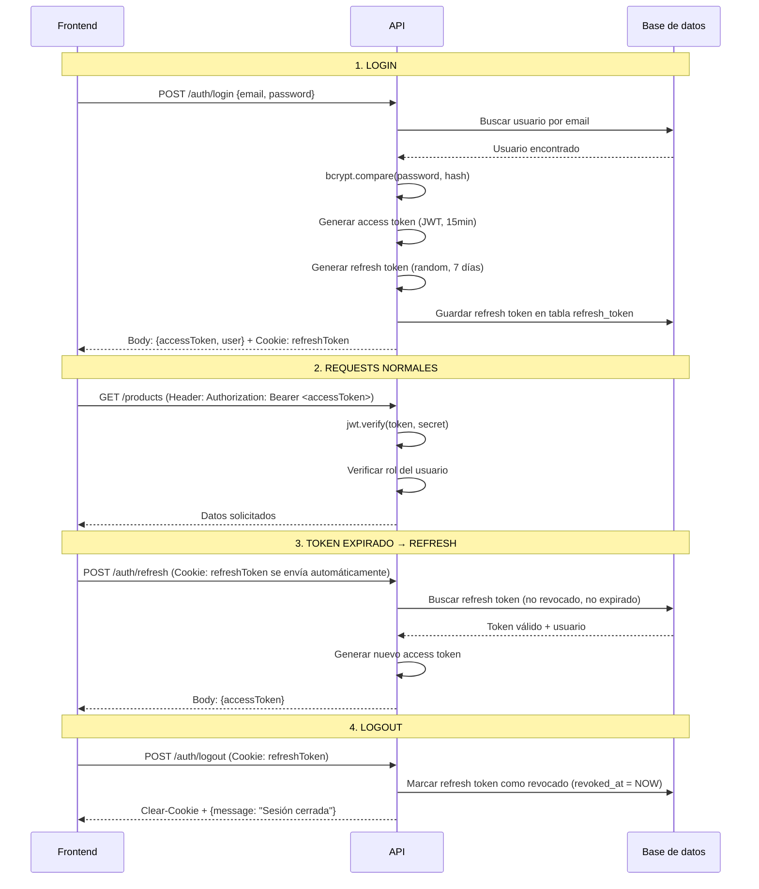

# Autenticación — Módulo Auth

## Resumen

El sistema usa **JWT (JSON Web Tokens)** con una estrategia de dos tokens:

- **Access token**: corta vida (15 min), se envía en cada request como header
- **Refresh token**: larga vida (7 días), almacenado en una cookie httpOnly

Esta combinación balancea seguridad y experiencia de usuario: el access token expira rápido (limitando daño si es robado), pero el usuario no necesita re-loguearse constantemente gracias al refresh token.

---

## Flujo completo



---

## Archivos involucrados

| Archivo | Responsabilidad |
|---------|-----------------|
| `auth.routes.ts` | Define los 3 endpoints (login, refresh, logout) |
| `auth.controller.ts` | Maneja HTTP: lee body/cookies, llama al service, configura cookies en response |
| `auth.service.ts` | Lógica de negocio: verificar credenciales, generar/validar tokens |
| `auth.schema.ts` | Validación Zod del body de login (email + password) |
| `refresh-token.model.ts` | Modelo Sequelize de la tabla `refresh_token` |
| `auth-guard.ts` (en middlewares) | Verifica el access token en rutas protegidas |

---

## Detalle de cada componente

### 1. Login (`POST /auth/login`)

**Input:** `{ "email": "admin@valhalla.com", "password": "Admin123!" }`

**Proceso:**

1. **Validación Zod** — verifica que email sea válido y password no esté vacío
2. **Buscar usuario** — `User.findOne({ where: { email, isActive: true } })` con su rol incluido
3. **Verificar password** — `bcrypt.compare(plainPassword, hashedPassword)` 
   - bcrypt compara el password enviado contra el hash almacenado
   - Si no coincide → `UnauthorizedError('Email o contraseña incorrectos')`
   - El mensaje es genérico a propósito (no revela si el email existe o no)
4. **Generar access token** — `jwt.sign({ id, role, email }, secret, { expiresIn: '15m' })`
5. **Generar refresh token** — `crypto.randomBytes(64).toString('hex')` (64 bytes → 128 chars hex)
6. **Guardar refresh token en BD** — con fecha de expiración (7 días)
7. **Responder**:
   - Body: `{ accessToken, user: { id, firstName, lastName, email, role } }`
   - Cookie: `refreshToken=<token>; HttpOnly; Secure; SameSite=Strict; Path=/api/v1/auth`

### 2. Refresh (`POST /auth/refresh`)

**Input:** Ninguno en el body. La cookie `refreshToken` se envía automáticamente por el navegador.

**Proceso:**

1. **Leer cookie** — `req.cookies.refreshToken`
2. **Buscar en BD** — `RefreshToken.findOne({ where: { token, revokedAt: null, expiresAt > NOW() } })`
   - Si no existe, está revocado, o está expirado → `UnauthorizedError`
3. **Verificar que el usuario sigue activo** — `user.isActive`
4. **Generar nuevo access token** — con los datos actuales del usuario
5. **Responder** — `{ accessToken }` (solo el nuevo access token)

**¿Por qué no rotar el refresh token?** Para simplificar. En una implementación más estricta, cada refresh genera un nuevo refresh token y revoca el anterior (rotation). Esto se puede agregar después si se necesita.

### 3. Logout (`POST /auth/logout`)

**Input:** Ninguno. La cookie se envía automáticamente.

**Proceso:**

1. **Leer cookie** — `req.cookies.refreshToken`
2. **Revocar en BD** — `storedToken.update({ revokedAt: new Date() })`
3. **Limpiar cookie** — `res.clearCookie('refreshToken')`
4. **Responder** — `{ message: "Sesión cerrada correctamente" }`

---

## Auth Guard (middleware de protección)

**Archivo:** `src/common/middlewares/auth-guard.ts`

Se usa como middleware en las rutas protegidas:

```typescript
routes.use('/users', authGuard(['admin']), userRoutes);
routes.use('/sales', authGuard(['admin', 'seller']), saleRoutes);
```

**Proceso:**

1. Lee el header `Authorization: Bearer <token>`
2. Extrae el token (split por espacio, toma la segunda parte)
3. `jwt.verify(token, JWT_ACCESS_SECRET)` — verifica firma y expiración
4. Decodifica el payload: `{ id, role, email }`
5. Si `allowedRoles` está definido, compara `decoded.role` contra la lista
6. Si pasa todo → `req.user = decoded` y llama a `next()`
7. Si falla → lanza el error apropiado:
   - Token ausente → `UnauthorizedError('Token no proporcionado')`
   - Token expirado → `UnauthorizedError('Token expirado')`
   - Token inválido → `UnauthorizedError('Token inválido')`
   - Rol no permitido → `ForbiddenError('No tienes permisos...')`

---

## Cookies: configuración explicada

```typescript
const COOKIE_OPTIONS = {
  httpOnly: true,       // JavaScript del navegador NO puede leer esta cookie
  secure: true,         // Solo se envía por HTTPS (en producción)
  sameSite: 'strict',   // No se envía en requests cross-site (protege contra CSRF)
  path: '/api/v1/auth', // Solo se envía a endpoints de /auth (no a /products, /sales, etc.)
  maxAge: 7 * 24 * 60 * 60 * 1000  // 7 días en milisegundos
};
```

| Propiedad | Para qué protege |
|-----------|-----------------|
| `httpOnly` | XSS — un script malicioso no puede robar la cookie |
| `secure` | MITM — no viaja en conexiones HTTP sin cifrar |
| `sameSite: strict` | CSRF — no se envía si el request viene de otro dominio |
| `path` | Minimización — solo se envía cuando es necesario (auth endpoints) |

---

## ¿Por qué no usar localStorage?

| Almacenamiento | Vulnerable a XSS | Vulnerable a CSRF |
|----------------|:-:|:-:|
| localStorage | ✅ Sí (cualquier script puede leerlo) | ❌ No |
| httpOnly cookie | ❌ No (inaccesible desde JS) | ✅ Sí (pero `sameSite` lo previene) |

Con cookies httpOnly + sameSite strict, estás protegido contra ambos vectores.

---

## Tabla `refresh_token`

```sql
CREATE TABLE refresh_token (
  id UUID PRIMARY KEY DEFAULT gen_random_uuid(),
  user_id UUID NOT NULL REFERENCES "user"(id) ON DELETE CASCADE,
  token VARCHAR(500) NOT NULL UNIQUE,
  expires_at TIMESTAMPTZ NOT NULL,
  created_at TIMESTAMPTZ NOT NULL DEFAULT NOW(),
  revoked_at TIMESTAMPTZ          -- NULL = activo, fecha = revocado
);
```

- **¿Por qué en BD y no solo JWT?** Porque necesitas poder invalidarlo (logout). Un JWT puro no se puede revocar — con BD sí.
- **`ON DELETE CASCADE`**: si borras un usuario, todos sus tokens desaparecen automáticamente.
- **Multi-dispositivo**: un usuario puede tener varios refresh tokens activos (uno por dispositivo).

---

## Seguridad adicional

| Medida | Implementación |
|--------|----------------|
| Rate limiting en login | 5 intentos por IP en 15 min (`authRateLimiter`) |
| Password hashing | bcrypt con 12 salt rounds |
| Error genérico en login | "Email o contraseña incorrectos" (no revela si el email existe) |
| Token opaco (refresh) | `crypto.randomBytes(64)` — no es un JWT, no se puede decodificar |
| Expiración corta (access) | 15 minutos — limita ventana de ataque si es robado |
| Cookie scoped | Solo se envía a `/api/v1/auth` (no a todos los endpoints) |

---

## Flujo desde el Frontend (Next.js)

```typescript
// 1. Login — guardar access token en memoria (NO localStorage)
const login = async (email: string, password: string) => {
  const res = await fetch('/api/v1/auth/login', {
    method: 'POST',
    credentials: 'include',  // IMPORTANTE: envía/recibe cookies
    headers: { 'Content-Type': 'application/json' },
    body: JSON.stringify({ email, password }),
  });
  const { data } = await res.json();
  setAccessToken(data.accessToken);  // En memoria (useState o variable)
};

// 2. Requests normales — enviar access token en header
const fetchProducts = async () => {
  const res = await fetch('/api/v1/products', {
    headers: { Authorization: `Bearer ${accessToken}` },
  });
  return res.json();
};

// 3. Refresh — cuando el access token expira (401)
const refresh = async () => {
  const res = await fetch('/api/v1/auth/refresh', {
    method: 'POST',
    credentials: 'include',  // La cookie se envía automáticamente
  });
  const { data } = await res.json();
  setAccessToken(data.accessToken);  // Nuevo token en memoria
};

// 4. Logout
const logout = async () => {
  await fetch('/api/v1/auth/logout', {
    method: 'POST',
    credentials: 'include',
  });
  setAccessToken(null);
  router.push('/login');
};
```

---

## Resumen visual

```
┌─────────────────────────────────────────────────────┐
│                    FRONTEND                          │
│                                                     │
│  Access Token (memoria)  ←── Solo vive en RAM       │
│  Refresh Token (cookie)  ←── httpOnly, invisible    │
└─────────────────┬───────────────────────────────────┘
                  │
                  ▼
┌─────────────────────────────────────────────────────┐
│                    BACKEND                           │
│                                                     │
│  authGuard ── verifica access token (header)        │
│  /auth/refresh ── lee refresh token (cookie)        │
│  /auth/logout ── revoca refresh token (BD)          │
└─────────────────┬───────────────────────────────────┘
                  │
                  ▼
┌─────────────────────────────────────────────────────┐
│               POSTGRESQL                            │
│                                                     │
│  user.password ── bcrypt hash                       │
│  refresh_token ── tokens activos/revocados          │
└─────────────────────────────────────────────────────┘
```
