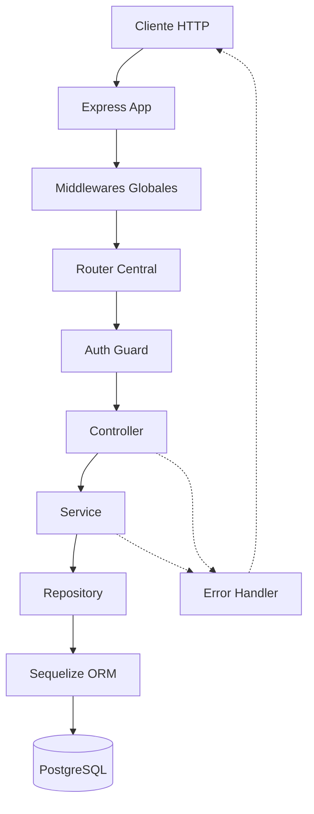

# Arquitectura del Backend

## Visión general

El backend sigue una **arquitectura modular por dominio** con capas bien definidas. Cada módulo encapsula una funcionalidad de negocio completa (modelo, acceso a datos, lógica, transporte HTTP, validación).



---

## Stack tecnológico

| Componente | Tecnología | Propósito |
|------------|------------|-----------|
| Runtime | Node.js 20+ | Ejecución de JavaScript/TypeScript |
| Framework | Express 5 | HTTP server + routing |
| Lenguaje | TypeScript 7 (strict) | Tipado estático |
| ORM | Sequelize + sequelize-typescript | Mapeo objeto-relacional con decoradores |
| Base de datos | PostgreSQL 16 | Almacenamiento persistente |
| Validación | Zod | Schema validation en request body |
| Auth | JWT + bcrypt | Autenticación y hashing de passwords |
| Logging | Pino + pino-http | Logging estructurado |
| Docs | Swagger (swagger-jsdoc) | Documentación OpenAPI |
| Migraciones | umzug | Versionado del esquema de BD |
| Seguridad | Helmet, express-rate-limit, CORS | Headers, throttling, políticas de origen |
| Dev | tsx (watch mode) | Ejecución directa de TypeScript |
| Build | tsup | Compilación para producción |

---

## Estructura de carpetas

```
api/src/
├── config/
│   ├── database.ts          → Instancia Sequelize + registro de modelos
│   ├── environment.ts       → Validación de env vars con Zod (fail fast)
│   └── swagger.ts           → Configuración OpenAPI 3.0
│
├── common/
│   ├── errors/
│   │   ├── app-error.ts     → Clase base de errores operacionales
│   │   ├── not-found.error.ts
│   │   ├── validation.error.ts
│   │   ├── unauthorized.error.ts
│   │   ├── forbidden.error.ts
│   │   ├── conflict.error.ts
│   │   └── index.ts         → Barrel export
│   ├── middlewares/
│   │   ├── auth-guard.ts    → JWT verification + role check
│   │   ├── validate-schema.ts → Zod validation middleware factory
│   │   ├── async-handler.ts → Wrapper para eliminar try-catch
│   │   ├── error-handler.ts → Global error handler (último middleware)
│   │   ├── not-found-handler.ts → 404 para rutas no definidas
│   │   ├── rate-limiter.ts  → General + auth-specific rate limits
│   │   └── index.ts
│   ├── helpers/
│   │   ├── response.ts     → sendSuccess(), sendCreated(), sendNoContent()
│   │   ├── pagination.ts   → parsePaginationParams(), buildPaginationMeta()
│   │   └── index.ts
│   └── logger.ts           → Instancia Pino (singleton)
│
├── database/
│   ├── migrations/          → 12 archivos de migración (ordenados por timestamp)
│   ├── seeders/             → Datos iniciales (roles, admin, categorías)
│   ├── migrate.ts           → Runner de migraciones (umzug)
│   └── seed.ts             → Runner de seeders (umzug)
│
├── modules/
│   ├── auth/
│   │   ├── refresh-token.model.ts
│   │   ├── auth.service.ts
│   │   ├── auth.controller.ts
│   │   ├── auth.schema.ts
│   │   ├── auth.routes.ts
│   │   └── index.ts
│   ├── catalog/
│   │   ├── models/          → Role, DocumentType, PaymentMethod, ProductCategory
│   │   ├── catalog.service.ts
│   │   ├── catalog.controller.ts
│   │   ├── catalog.schema.ts
│   │   ├── catalog.routes.ts
│   │   └── index.ts
│   ├── user/
│   │   ├── user.model.ts
│   │   ├── user.repository.ts
│   │   ├── user.service.ts
│   │   ├── user.controller.ts
│   │   ├── user.schema.ts
│   │   ├── user.routes.ts
│   │   └── index.ts
│   ├── company/             → Mismo patrón
│   ├── provider/            → Mismo patrón
│   ├── client/              → Mismo patrón
│   ├── product/             → Mismo patrón + búsqueda por código
│   ├── purchase/            → Transaccional (service con sequelize.transaction)
│   └── sale/                → Transaccional (validación de stock)
│
├── app.ts                   → Configuración Express (middlewares en orden)
├── routes.ts                → Registro centralizado de rutas
└── index.ts                 → Bootstrap (conectar BD, levantar servidor)
```

---

## Convenciones de imports

| Convención | Ejemplo |
|-----------|---------|
| Sin extensión de archivo | `from './user.service'` (no `.js` ni `.ts`) |
| Barrels por módulo | `from './modules/user'` resuelve `./modules/user/index.ts` |
| `moduleResolution: "bundler"` | TypeScript resuelve archivos `.ts` automáticamente |
| DTOs tipados | `type CreateUserDto = z.infer<typeof createUserSchema>` |
| No barrel global | Cada módulo tiene su `index.ts`, pero no hay uno en `modules/` |

Esto funciona porque:
- **Dev** (`tsx`): resuelve imports como un bundler
- **Build** (`tsup`): bundlea todo, resuelve igual
- **Typecheck** (`tsc --noEmit`): `moduleResolution: "bundler"` acepta imports sin extensión

---

## Capas de la arquitectura

### 1. Controller (Transporte HTTP)

**Responsabilidad:** Recibir request, extraer datos, llamar al service, formatear response.

```typescript
static async getAll(req: Request, res: Response) {
  const params = parsePaginationParams(req.query);
  const result = await service.getAll(params);
  sendSuccess(res, result.data, result.meta);
}
```

- NO contiene lógica de negocio
- NO accede a la base de datos directamente
- Solo conoce Request/Response de Express

### 2. Service (Lógica de negocio)

**Responsabilidad:** Validaciones de negocio, orquestación, cálculos.

```typescript
async create(data: { email: string; password: string }) {
  const existing = await this.repository.findByEmail(data.email);
  if (existing) throw new ConflictError('El email ya está registrado');
  const hashedPassword = await bcrypt.hash(data.password, 12);
  return this.repository.create({ ...data, password: hashedPassword });
}
```

- NO conoce Express (ni req, ni res)
- Lanza errores que el middleware captura
- Coordina múltiples repositories si es necesario (ej: ventas)

### 3. Repository (Acceso a datos)

**Responsabilidad:** Queries a la base de datos. Único punto que habla con Sequelize.

```typescript
async findAll(params: PaginationParams, filters?: { isActive?: boolean }) {
  return Model.findAndCountAll({ where, include, limit, offset, order });
}
```

- Si cambias de ORM, solo este archivo cambia
- Define qué relaciones se incluyen en las queries
- Maneja paginación y filtros a nivel de query

### 4. Model (Entidad)

**Responsabilidad:** Definir la estructura de la tabla y sus relaciones.

- Usa decoradores de `sequelize-typescript`
- Define tipos de datos, constraints, FKs
- Declara relaciones (@BelongsTo, @HasMany)

### 5. Schema (Validación de entrada)

**Responsabilidad:** Definir qué datos acepta cada endpoint.

- Usa Zod para validación declarativa
- Schemas separados por operación (Create ≠ Update)
- El middleware `validateSchema()` los aplica antes del controller

---

## Flujo de un request

```
1. Express recibe request HTTP
2. Helmet → Headers de seguridad
3. Rate Limiter → Verifica límite de requests
4. CORS → Valida origen
5. Body Parser → Parsea JSON
6. Cookie Parser → Lee cookies (refresh token)
7. Pino HTTP → Loguea el request
8. Router → Determina qué handler ejecutar
9. Auth Guard → Verifica JWT + rol (si la ruta es protegida)
10. Validate Schema → Valida req.body contra Zod schema
11. Async Handler → Envuelve el controller para capturar errores
12. Controller → Llama al service
13. Service → Ejecuta lógica de negocio
14. Repository → Query a PostgreSQL
15. Response → sendSuccess() formatea { success, data, meta }
```

Si algo falla en cualquier punto:
```
Error → asyncHandler captura → errorHandler middleware → { success: false, error: {...} }
```

---

## Patrones de diseño implementados

| Patrón | Dónde | Propósito |
|--------|-------|-----------|
| **Repository** | `*.repository.ts` | Aislar acceso a datos del negocio |
| **Service Layer** | `*.service.ts` | Encapsular lógica de negocio |
| **Factory Function** | `authGuard()`, `validateSchema()` | Crear middlewares configurables |
| **Singleton** | `logger.ts`, `database.ts` | Una instancia compartida |
| **Strategy** | `authGuard(['admin'])` vs `authGuard(['seller'])` | Roles intercambiables |
| **Template Method** | Todos los CRUD siguen el mismo patrón | Consistencia |
| **Error Hierarchy** | `AppError` → `NotFoundError`, etc. | Errores tipados y predecibles |

---

## Principios SOLID aplicados

| Principio | Cómo se aplica |
|-----------|----------------|
| **S** — Single Responsibility | Controller = HTTP, Service = negocio, Repository = datos |
| **O** — Open/Closed | Agregar un módulo no modifica los existentes |
| **L** — Liskov Substitution | Todas las clases de error son intercambiables en el handler |
| **I** — Interface Segregation | Schemas de Create ≠ Update (no obligas campos innecesarios) |
| **D** — Dependency Inversion | Service recibe repository por constructor (inyectable) |

---

## Seguridad

| Mecanismo | Implementación |
|-----------|----------------|
| Autenticación | JWT access token (15 min) + refresh token (7 días, httpOnly cookie) |
| Autorización | Role-based: `authGuard(['admin', 'seller'])` |
| Password | bcrypt con 12 salt rounds |
| Headers | Helmet (X-Frame-Options, CSP, etc.) |
| Rate limiting | 100 req/15min general, 5 req/15min para login |
| CORS | Solo orígenes configurados en env |
| Input validation | Zod en todas las rutas con body |
| SQL injection | Sequelize parametriza queries automáticamente |
| Env validation | Zod valida env vars al arrancar (fail fast) |

---

## Manejo de errores

```
AppError (base)
├── NotFoundError (404)
├── ValidationError (400)
├── UnauthorizedError (401)
├── ForbiddenError (403)
└── ConflictError (409)
```

- Errores operacionales (`isOperational = true`): se devuelven al cliente con su código y mensaje
- Errores inesperados (bugs): se loguean con Pino y se devuelve un mensaje genérico "Error interno del servidor"
- El middleware `errorHandler` es el ÚLTIMO registrado en Express y captura todo

---

## Paginación

Todos los listados soportan:

```
GET /api/v1/products?page=2&limit=10&search=coca&category_id=1&sort=name&order=asc
```

Respuesta incluye metadata:

```json
{
  "success": true,
  "data": [...],
  "meta": {
    "page": 2,
    "limit": 10,
    "total": 45,
    "totalPages": 5
  }
}
```

---

## Migraciones y Seeders

El versionado del esquema se maneja con **umzug**. Existen dos flujos independientes, cada uno con su propia tabla de tracking:

| Flujo | Comando | Tabla de tracking | Contenido |
|-------|---------|-------------------|-----------|
| Migraciones | `pnpm run migrate` | `SequelizeMeta` | Estructura (CREATE, ALTER, índices, triggers) |
| Seeders | `pnpm run seed` | `SequelizeSeederMeta` | Datos iniciales (roles, tipos de documento, métodos de pago, categorías, admin) |

### Idempotencia

Ambos flujos son **idempotentes**: ejecutarlos múltiples veces no duplica datos ni rompe constraints.

- **Migraciones:** umzug solo aplica las migraciones que no están registradas en `SequelizeMeta`. En reinicios, no hay pendientes → no hace nada. Las migraciones nunca contienen `DROP` en su `up()`, por lo que **los datos no se pierden en reinicios**.
- **Seeders (doble capa de protección):**
  1. `SequelizeSeederMeta` evita re-ejecución en reinicios normales.
  2. Cada seeder verifica existencia antes de insertar (`SELECT ... WHERE` previo al `bulkInsert`). Si la tabla de tracking se perdiera o reseteara, re-ejecutar el seeder **no crea duplicados ni falla** en columnas `UNIQUE` (`role.name`, `document_type.name`, `payment_method.name`, `user.email`).

Esto es especialmente importante en despliegues donde el contenedor reinicia y ejecuta migraciones + seeders en cada arranque (ver sección de Despliegue). Los datos de negocio (ventas, productos, clientes) siempre persisten en la base de datos externa.

### Arranque automatizado en producción

El script `scripts/bootstrap.mjs` ejecuta al arrancar el contenedor, en orden:

1. Espera a que la base de datos acepte conexiones (retry con backoff).
2. Aplica migraciones pendientes.
3. Aplica seeders pendientes.
4. Inicia el servidor HTTP.

Como migraciones y seeders son idempotentes, este arranque es seguro de repetir en cada reinicio del servicio.

---

## Módulo de Caja (Cash Register)

Gestiona sesiones de caja: abrir → registrar ventas → cerrar.

- **Modelo de caja compartida:** solo UNA caja puede estar abierta a la vez. Todos los vendedores acumulan sus ventas en la caja abierta del turno. Refleja una tienda con una sola gaveta física.
- **Validación de venta:** no se puede registrar una venta sin una caja abierta. El `SaleController` resuelve la caja activa; si no hay, responde `409 NO_OPEN_CASH_REGISTER`.
- **Cierre:** agrupa las ventas de la sesión por método de pago (tabla `cash_register_summary`), calcula el monto esperado (`fondo inicial + ventas en efectivo`) y la diferencia (`contado - esperado` = sobrante/faltante).
- **Rendimiento por vendedor:** NO se obtiene de la caja (que es compartida), sino de `sale.seller_id` vía el módulo Analytics (`/analytics/sales-by-seller`).

Endpoints: `open`, `close`, `current`, `status`, `history` (`GET /`), `getById`. Ver detalle en el README.

## Módulo de Analytics

Reportes agregados de solo lectura para el dashboard (rol admin). Ver documento dedicado: [analytics.md](./analytics.md).
