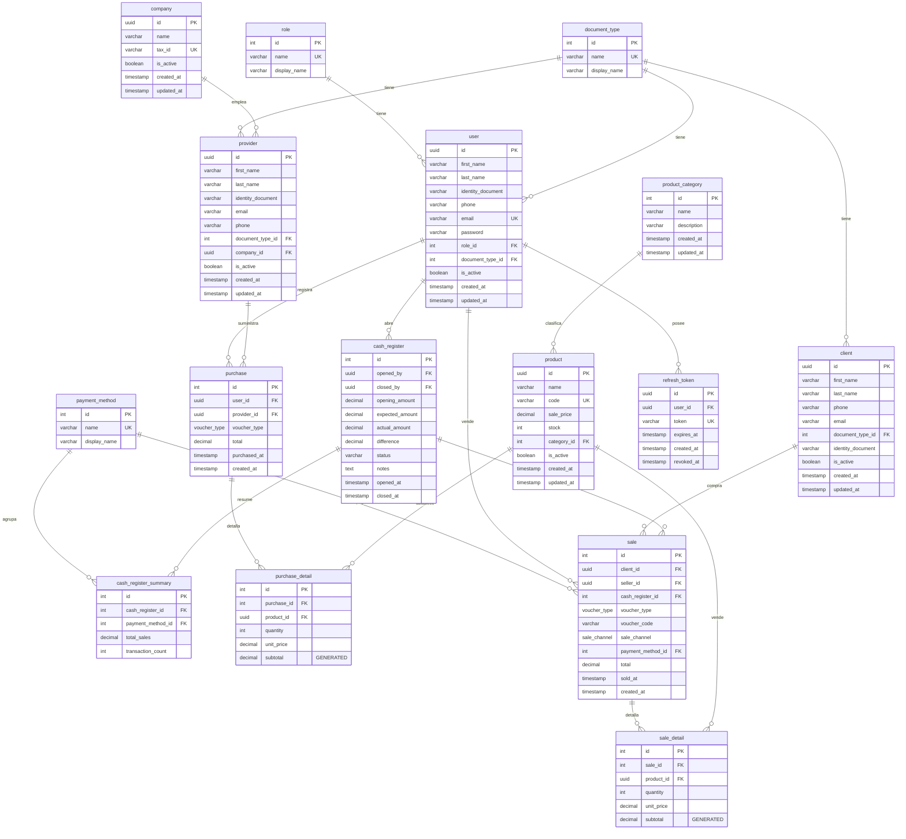

# Modelo de Datos

## Diagrama Entidad-Relación



---

## Tipos ENUM (PostgreSQL)

| Enum | Valores | Display (español) |
|------|---------|-------------------|
| `voucher_type` | `RECEIPT`, `INVOICE`, `TICKET` | Boleta, Factura, Ticket |
| `sale_channel` | `IN_STORE`, `ONLINE` | Presencial, Online |

---

## Tablas de referencia

### role

| id | name | display_name |
|----|------|--------------|
| 1 | admin | Administrador |
| 2 | seller | Vendedor |

### document_type

| id | name | display_name |
|----|------|--------------|
| 1 | DNI | DNI |
| 2 | PASSPORT | Pasaporte |
| 3 | FOREIGNER_ID | Carnet de Extranjería |
| 4 | OTHER | Otro |

### payment_method

| id | name | display_name |
|----|------|--------------|
| 1 | cash | Efectivo |
| 2 | yape | Yape |
| 3 | plin | Plin |
| 4 | debit_card | Tarjeta débito |
| 5 | credit_card | Tarjeta de crédito |

---

## Descripción de las entidades

### Catálogos

Tablas de datos que rara vez cambian. Cada una tiene `name` (código interno en inglés) y `display_name` (etiqueta en español para la UI).

### company

Empresas proveedoras identificadas por RUC (`tax_id` UNIQUE). Tiene muchos proveedores.

### user

Operadores del sistema. Se autentican con email/password. Su rol determina los permisos de acceso. Soft delete con `is_active`.

### provider

Personas de contacto en empresas proveedoras. Vinculados a una `company` y a un `document_type`.

### client

Clientes que compran productos. Opcionales en ventas (ventas anónimas permitidas). Requeridos para facturas.

### product

Artículos en inventario. El campo `code` es el valor del código de barras/QR (UNIQUE). Stock controlado por compras (+) y ventas (-).

### cash_register

Sesión de trabajo (apertura → ventas → cierre). Solo puede haber UNA abierta a la vez. Al cerrar se genera un `cash_register_summary` por método de pago.

### purchase / purchase_detail

Compras a proveedores. Cada compra tiene líneas de detalle con `subtotal` calculado automáticamente. Al crear, el stock del producto AUMENTA.

### sale / sale_detail

Ventas a clientes. Vinculadas a la caja abierta. `subtotal` generado automáticamente. Al crear, el stock DISMINUYE. Se valida que haya stock suficiente.

### refresh_token

Tokens de refresco para la autenticación JWT. Multi-dispositivo. Se revocan al hacer logout.

---

## Reglas de integridad

| Regla | Implementación |
|-------|----------------|
| No borrar productos con ventas | `ON DELETE RESTRICT` en FK de `sale_detail` |
| No borrar proveedores con compras | `ON DELETE RESTRICT` en FK de `purchase` |
| Precio siempre positivo | `CHECK (sale_price > 0)` en `product` |
| Stock nunca negativo | `CHECK (stock >= 0)` en `product` |
| Cantidad siempre positiva | `CHECK (quantity > 0)` en detalles |
| Subtotal calculado automático | `GENERATED ALWAYS AS (quantity * unit_price) STORED` |
| `updated_at` automático | Trigger PostgreSQL `update_updated_at_column()` |
| Email único por usuario | `UNIQUE` constraint en `user.email` |
| RUC único por empresa | `UNIQUE` constraint en `company.tax_id` |
| Código único por producto | `UNIQUE` constraint en `product.code` |
| Detalles se eliminan con su padre | `ON DELETE CASCADE` en detalles → purchase/sale |

---

## Migraciones

Las migraciones se encuentran en `api/src/database/migrations/` y se ejecutan con:

```bash
cd api
pnpm run migrate        # Aplicar pendientes
pnpm run migrate down   # Revertir última
pnpm run migrate pending # Ver cuáles faltan
```

Orden de ejecución:

1. ENUMs (`voucher_type`, `sale_channel`)
2. Tablas de referencia
3. `company`
4. `user`
5. `provider`
6. `client`
7. `product`
8. `cash_register` + `cash_register_summary`
9. `purchase` + `purchase_detail`
10. `sale` + `sale_detail`
11. `refresh_token`
12. Trigger `updated_at`
